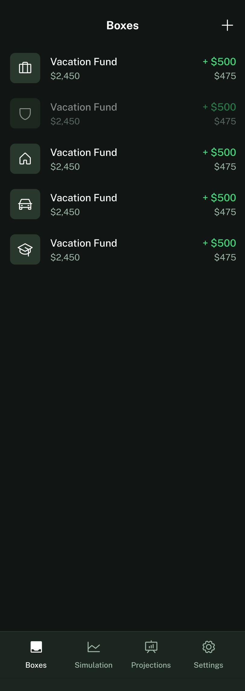
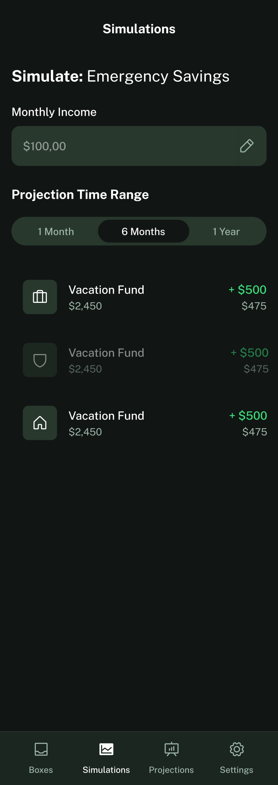
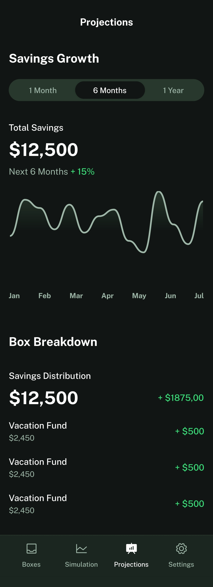
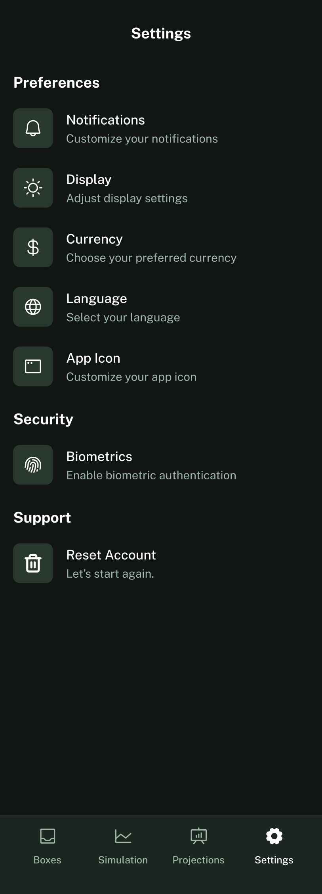
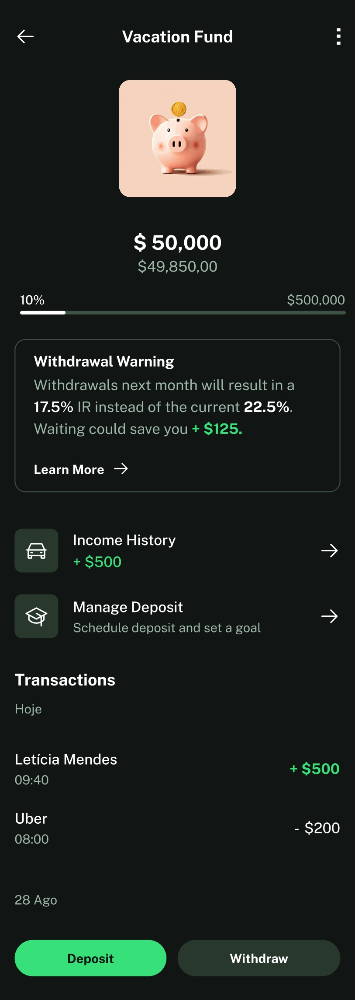
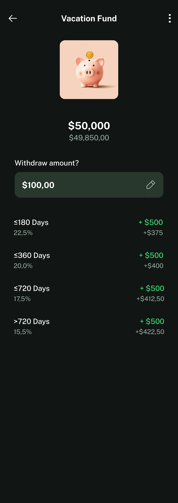
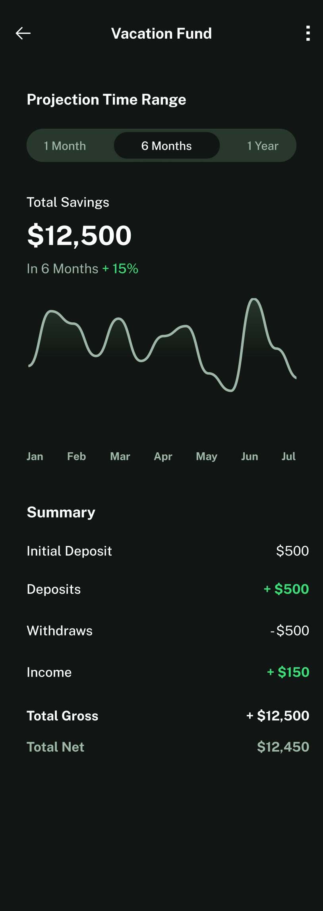

# 🌱 SproutJar  

SproutJar is an Android app (in development) that helps you **visualize your savings, simulate future scenarios, and manage your money with clarity**.  
It separates **gross vs. net income**, includes IR/IOF tax simulations, and lets you set financial goals with projections and income history.  

## 🚧 Status  

⚠️ **Work in Progress** – This project is actively being developed. Features, UI, and architecture are subject to change.  

## 📱 Features (Planned & In Progress)  

- **Biometric authentication** 🔒 – Fingerprint / face recognition login.  
- **Custom themes & icons** 🎨 – Switch look and feel.  
- **Multi-language support** 🌍 – Change app language in settings.
- **Multi-currency support** 💵 – Change app currency in settings.  
- **Notifications (Firebase)** 🔔 – Reminders and goal updates.  
- **Widgets** 📊 – Savings glance on the home screen.  
- **Money management** 💰  
  - Multiple funds (vacation, emergency, etc.)  
  - Deposit scheduling & income history  
  - Withdrawal projections with IR/IOF tax impact  
- **Simulations & Projections** 📈  
  - Test different savings scenarios  
  - Visual growth charts 

  
  
  
  
  
  
  
  

